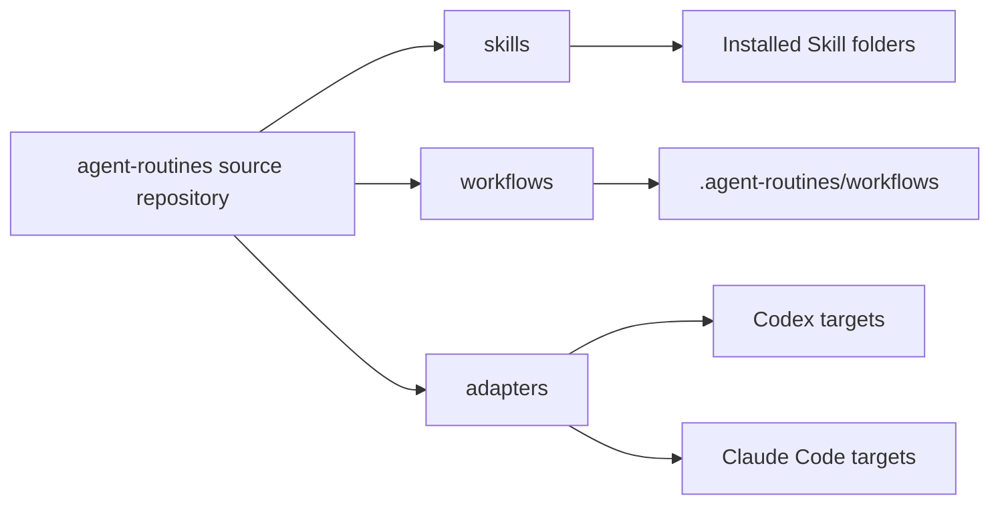

# Architecture

The source repository is the only maintenance source of truth. Skills describe agent judgment and workflows provide deterministic execution. Adapters copy content into Codex, Claude Code, or project-local installation targets without changing the source.

## Runtime Paths

- Codex user Skills: `~/.codex/skills`
- Codex project Skills: `.codex/skills`
- Claude Code user Skills: `~/.claude/skills`
- Claude Code project Skills: `.claude/skills`
- Workflow runtime: `~/.agent-routines/workflows` or `.agent-routines/workflows`

Skills should reference installed workflow runtime paths first and the source repository second. Tool-specific behavior belongs in adapters or documentation.

## Discovery And Graph Governance

Agents should use codebase-memory-mcp graph tools first when the repository is indexed: `search_graph`, `trace_path`, `get_code_snippet`, `query_graph`, then `get_architecture`. If the project is not indexed, graph results are insufficient, or the target is non-code content, agents should fall back to `rg`, file search, or direct file reading and record the fallback reason.

Graph and MCP configuration is an environment concern, not a source artifact. This repository documents graph-first discovery in `AGENTS.md` but does not ship a default `.mcp.json` because server paths are user- and workspace-specific.
