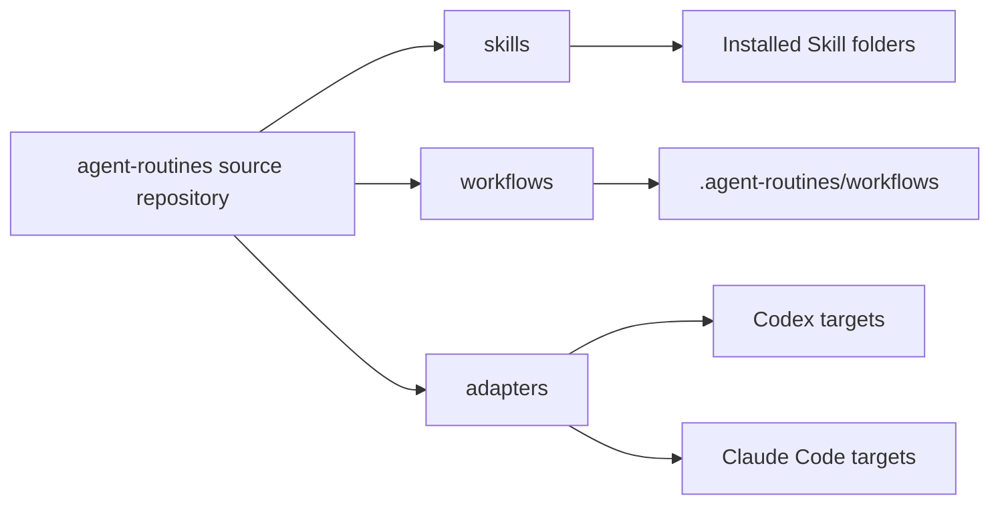

# Architecture

The source repository is the only maintenance source of truth. Skills describe agent judgment and workflows provide deterministic execution. Adapters copy content into Codex, Claude Code, or project-local installation targets without changing the source.

## Runtime Paths

- Codex user Skills: `~/.codex/skills`
- Codex project Skills: `.codex/skills`
- Claude Code user Skills: `~/.claude/skills`
- Claude Code project Skills: `.claude/skills`
- Workflow runtime: `~/.agent-routines/workflows` or `.agent-routines/workflows`

Skills should reference installed workflow runtime paths first and the source repository second. Tool-specific behavior belongs in adapters or documentation.
