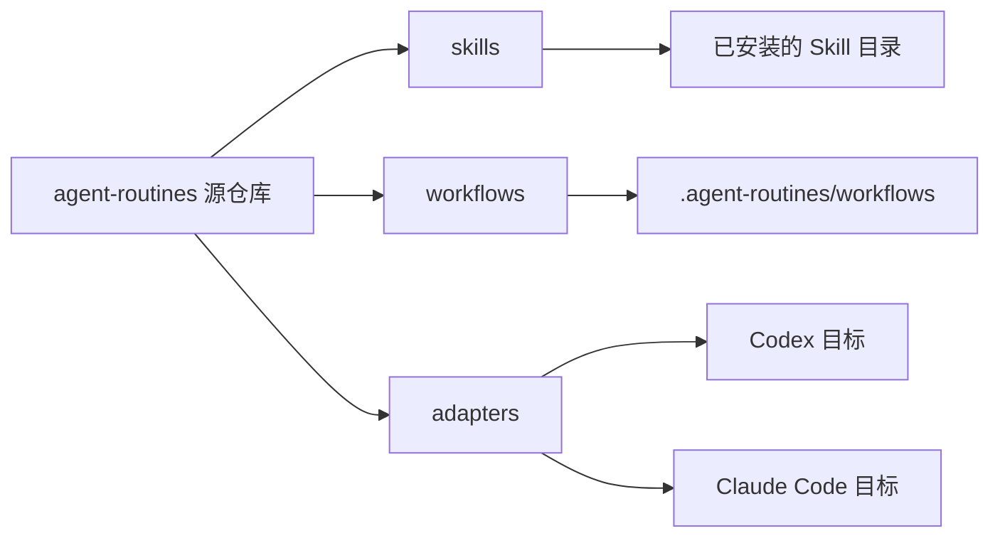

# 架构

源代码仓库是维护层面的唯一事实来源。Skills 描述 agent 的判断逻辑，workflows 提供确定性执行。Adapters 将内容复制到 Codex、Claude Code 或项目本地安装目标，而不改变源内容。

## 运行时路径

- Codex 用户级 Skills：`~/.codex/skills`
- Codex 项目级 Skills：`.codex/skills`
- Claude Code 用户级 Skills：`~/.claude/skills`
- Claude Code 项目级 Skills：`.claude/skills`
- Workflow 运行时：`~/.agent-routines/workflows` 或 `.agent-routines/workflows`

Skills 应优先引用已安装的 workflow 运行时路径，其次才引用源仓库。工具特定行为应放在 adapters 或文档中。
