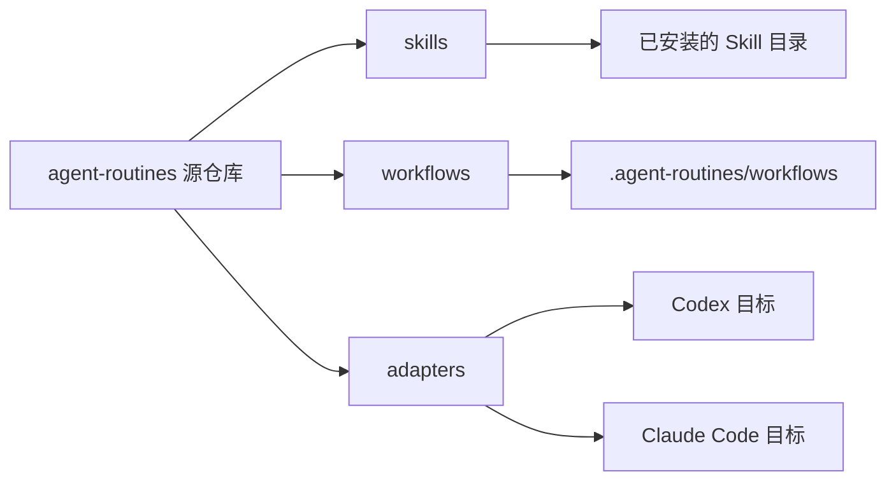

# 架构

源代码仓库是维护层面的唯一事实来源。Skills 描述 agent 的判断逻辑，workflows 提供确定性执行。Adapters 将内容复制到 Codex、Claude Code 或项目本地安装目标，而不改变源内容。

## 运行时路径

- Codex 用户级 Skills：`~/.codex/skills`
- Codex 项目级 Skills：`.codex/skills`
- Claude Code 用户级 Skills：`~/.claude/skills`
- Claude Code 项目级 Skills：`.claude/skills`
- Workflow 运行时：`~/.agent-routines/workflows` 或 `.agent-routines/workflows`

Skills 应优先引用已安装的 workflow 运行时路径，其次才引用源仓库。工具特定行为应放在 adapters 或文档中。

## 发现流程与 Graph 治理

当本仓库已经被 codebase-memory-mcp 索引时，agent 应优先使用 graph 工具：`search_graph`、`trace_path`、`get_code_snippet`、`query_graph`，然后是 `get_architecture`。如果项目未索引、graph 结果不足，或目标是 Markdown、JSON、shell 脚本、CI 配置、文档等非代码内容，则回退到 `rg`、文件搜索或直接阅读，并记录回退原因。

Graph 和 MCP 配置属于环境层，而不是源仓库产物。本仓库在 `AGENTS.md` 中记录 graph-first 发现规则，但默认不分发 `.mcp.json`，因为 MCP server 路径通常与用户和 workspace 绑定。
