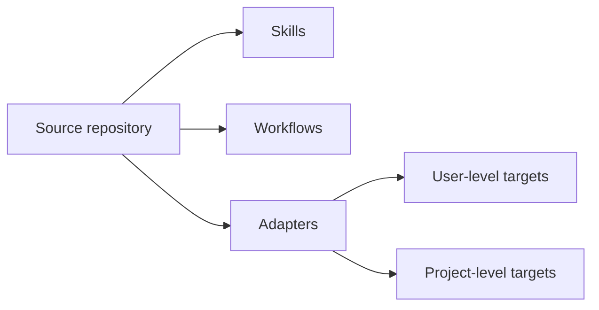
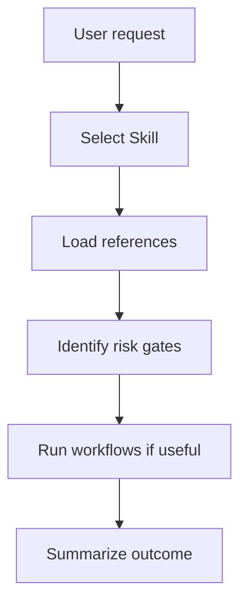
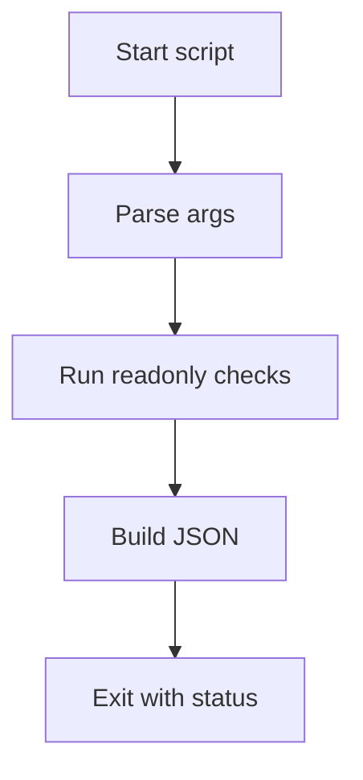
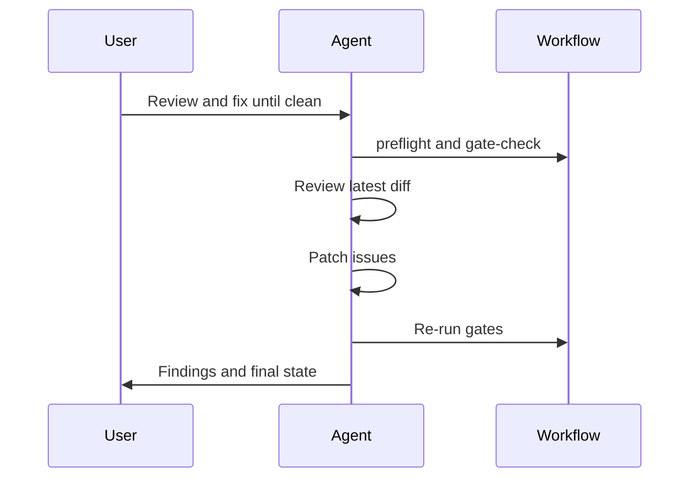
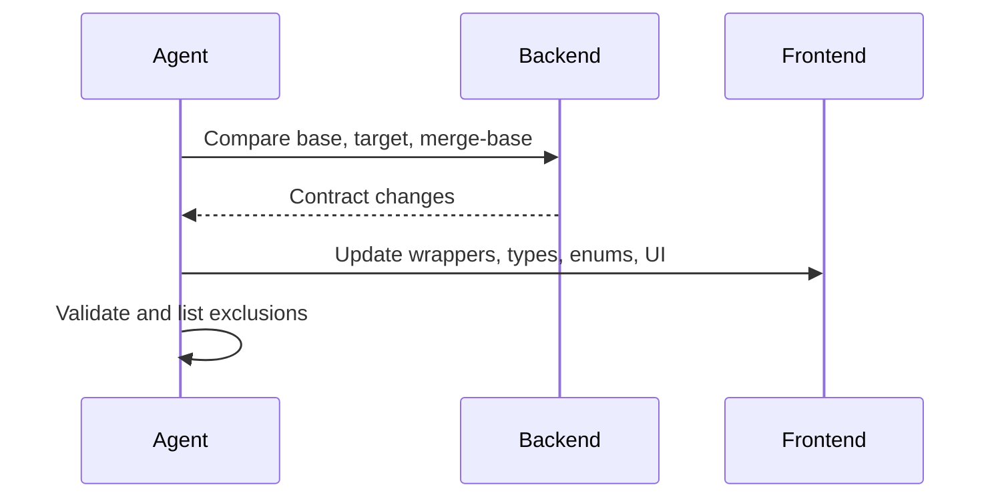
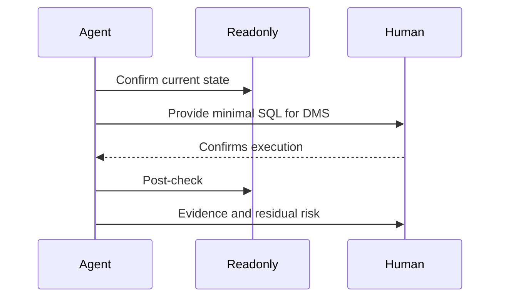
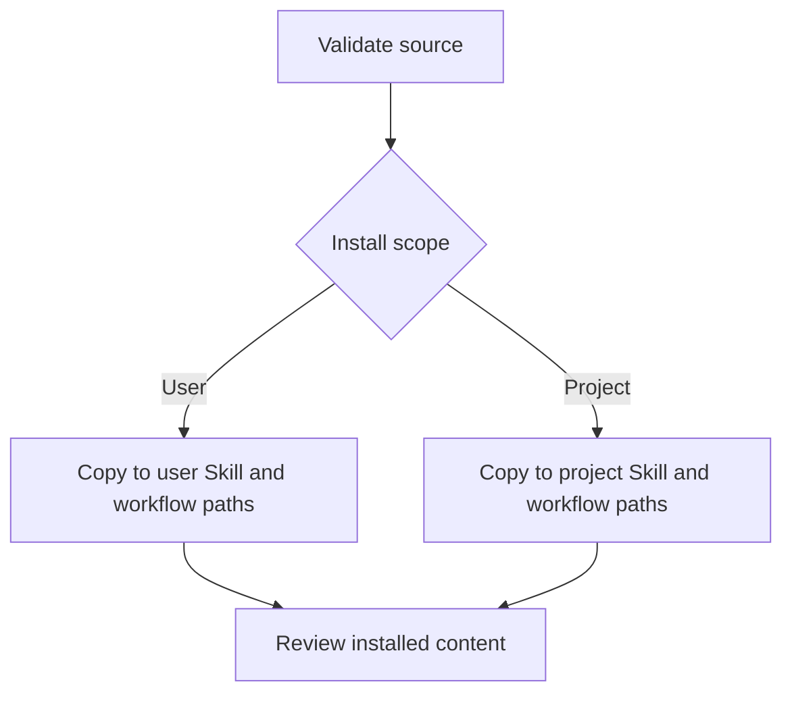
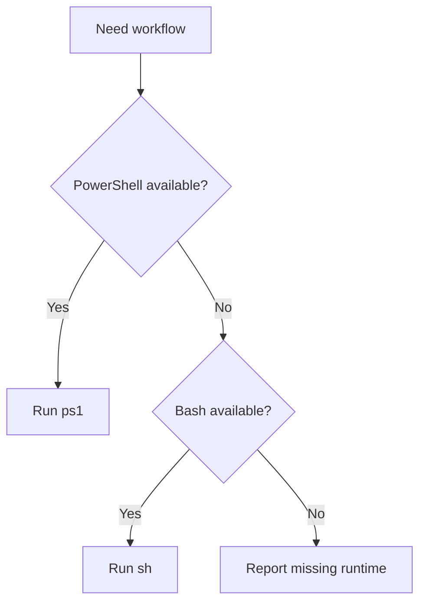

# Diagrams

## System Architecture

## Skill Invocation Flowchart

## Workflow Execution Flowchart

## Review-Loop Sequence

## API-Sync Sequence

## DMS-Repair Sequence

## Distribution Flowchart

## Cross-Platform Runtime Selection

