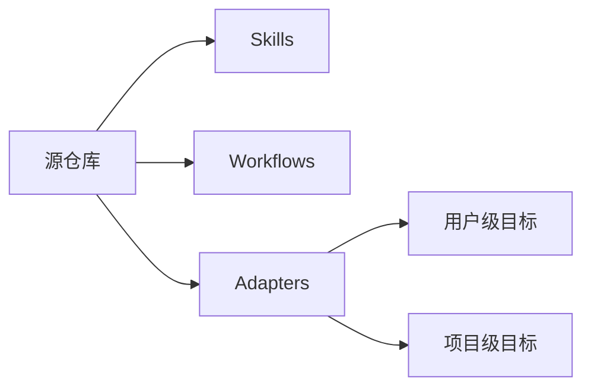
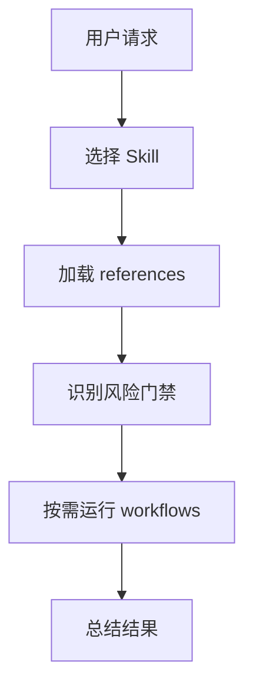
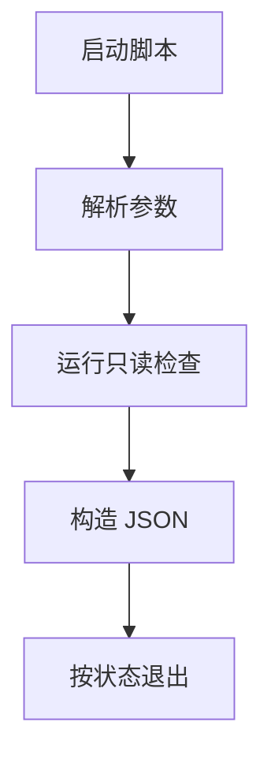
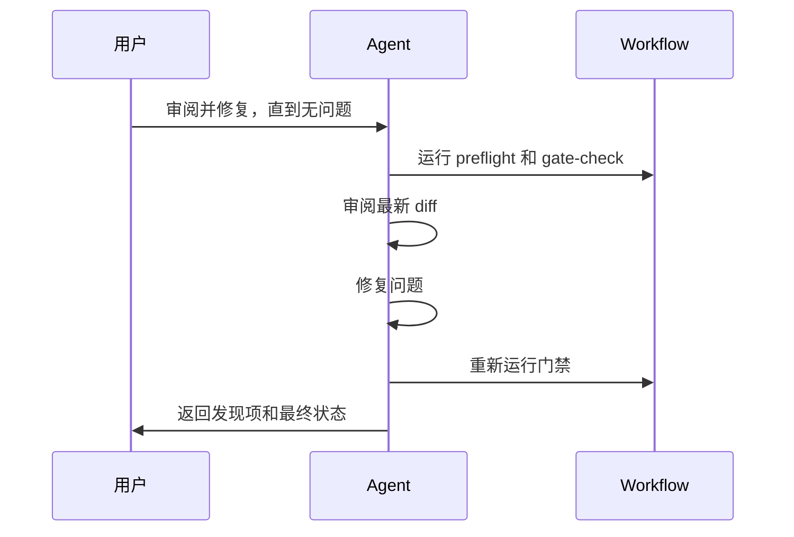
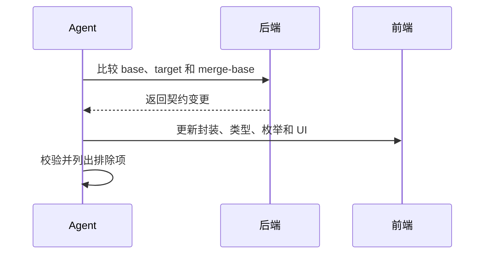
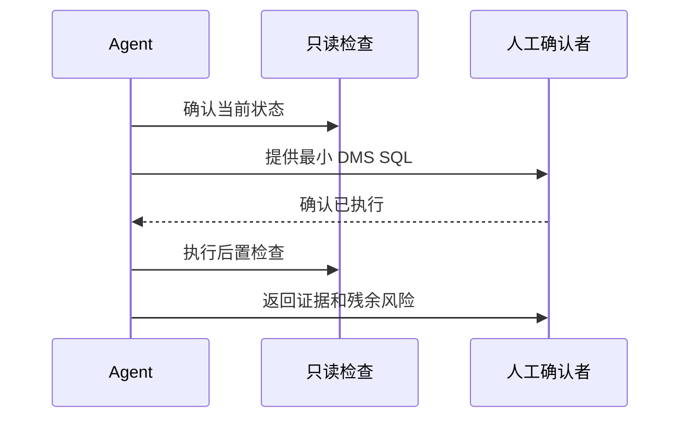
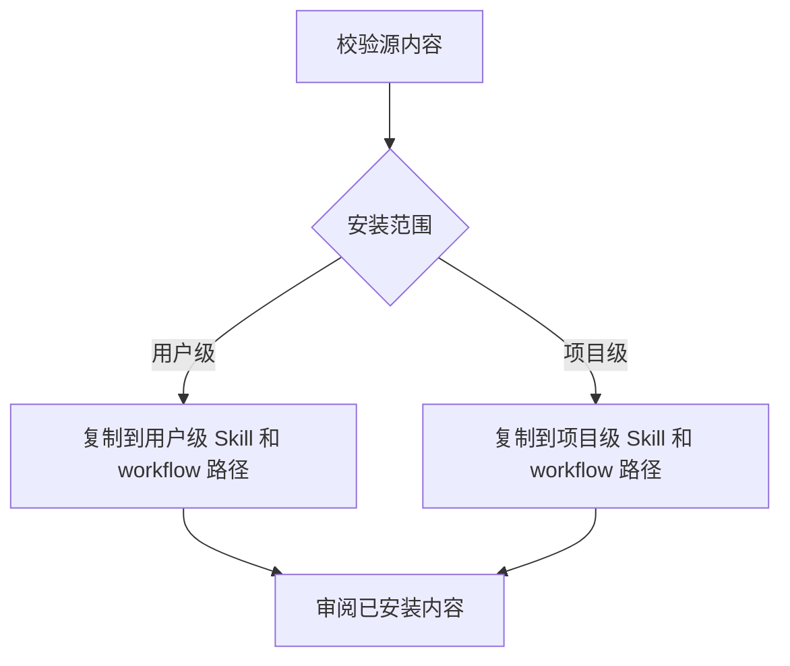
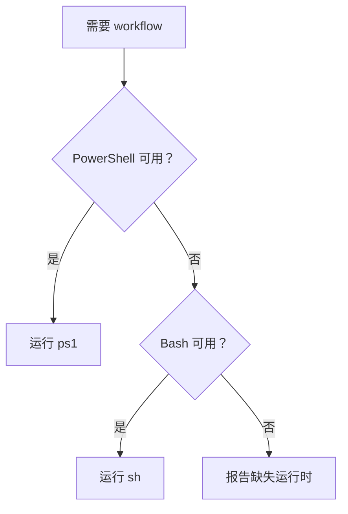

# 图表

## 系统架构

```mermaid
flowchart LR
  Repo[源仓库] --> Skills[Skills]
  Repo --> Workflows[Workflows]
  Repo --> Adapters[Adapters]
  Adapters --> UserTargets[用户级目标]
  Adapters --> ProjectTargets[项目级目标]
```

## Skill 调用流程图

```mermaid
flowchart TD
  A[用户请求] --> B[选择 Skill]
  B --> C[加载 references]
  C --> D[识别风险门禁]
  D --> E[按需运行 workflows]
  E --> F[总结结果]
```

## Workflow 执行流程图

```mermaid
flowchart TD
  A[启动脚本] --> B[解析参数]
  B --> C[运行只读检查]
  C --> D[构造 JSON]
  D --> E[按状态退出]
```

## Review-Loop 时序图

```mermaid
sequenceDiagram
  participant User as 用户
  participant Agent
  participant Workflow
  User->>Agent: 审阅并修复，直到无问题
  Agent->>Workflow: 运行 preflight 和 gate-check
  Agent->>Agent: 审阅最新 diff
  Agent->>Agent: 修复问题
  Agent->>Workflow: 重新运行门禁
  Agent->>User: 返回发现项和最终状态
```

## API-Sync 时序图

```mermaid
sequenceDiagram
  participant Agent
  participant Backend as 后端
  participant Frontend as 前端
  Agent->>Backend: 比较 base、target 和 merge-base
  Backend-->>Agent: 返回契约变更
  Agent->>Frontend: 更新封装、类型、枚举和 UI
  Agent->>Agent: 校验并列出排除项
```

## DMS-Repair 时序图

```mermaid
sequenceDiagram
  participant Agent
  participant Readonly as 只读检查
  participant Human as 人工确认者
  Agent->>Readonly: 确认当前状态
  Agent->>Human: 提供最小 DMS SQL
  Human-->>Agent: 确认已执行
  Agent->>Readonly: 执行后置检查
  Agent->>Human: 返回证据和残余风险
```

## 分发流程图

```mermaid
flowchart TD
  A[校验源内容] --> B{安装范围}
  B -->|用户级| C[复制到用户级 Skill 和 workflow 路径]
  B -->|项目级| D[复制到项目级 Skill 和 workflow 路径]
  C --> E[审阅已安装内容]
  D --> E
```

## 跨平台运行时选择

```mermaid
flowchart TD
  A[需要 workflow] --> B{PowerShell 可用？}
  B -->|是| C[运行 ps1]
  B -->|否| D{Bash 可用？}
  D -->|是| E[运行 sh]
  D -->|否| F[报告缺失运行时]
```
