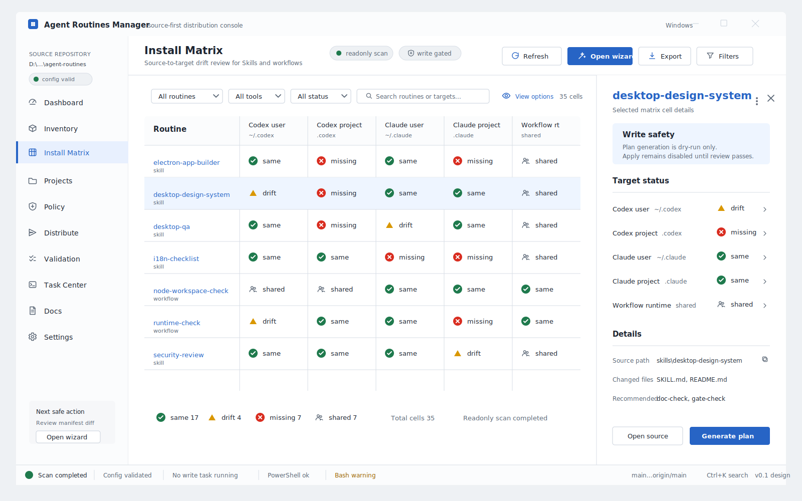
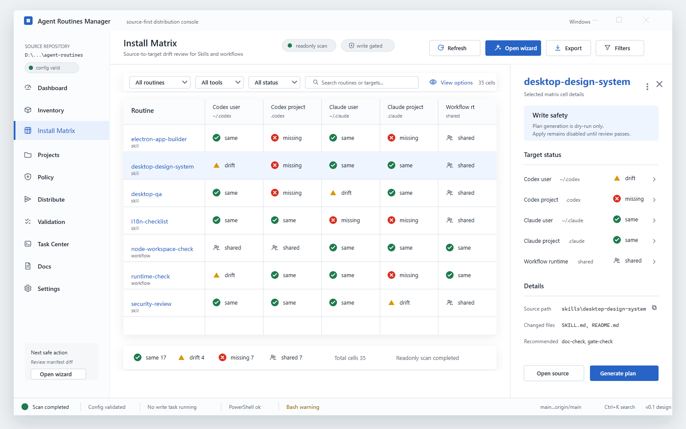
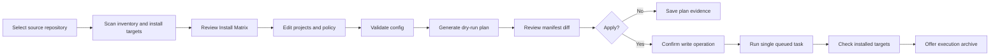

# Electron App UI Design

This document is the frontend design contract for Agent Routines Manager. It complements [Electron App Execution Plan](electron-app-plan.md) with screen layouts, component behavior, visual tokens, and interaction rules that future implementation agents must follow.

The design target is a restrained desktop operations console. It should feel like a practical repository management tool, not a landing page, not an AI assistant product, and not a decorative dashboard.

Rendered implementation mockup:



Raster visual preview:



Use the SVG as the implementation reference for exact labels, status values, and layout. Use the PNG only as a visual style preview.

Optimized reference coverage:

- Native desktop window frame, fixed left navigation, view command bar, main matrix work surface, right detail drawer, and always-visible status bar.
- Install Matrix as the first visual priority, with seven representative routines across five install targets.
- Every matrix status uses icon plus text: `same`, `drift`, `missing`, and `shared`.
- The selected-cell drawer includes write-safety context, per-target status, source path, changed files, recommended workflows, and gated actions.
- The PNG preview is rendered from the SVG reference and should be regenerated when the SVG changes.

## Product Workflow Map

The primary operator path is source-first and write-gated:



Secondary paths must never bypass this path:

- Repository gates can be run from `Validation`, but write actions still happen only in `Distribute`.
- Task logs are available globally, but commands still originate from allowlisted UI actions.
- Settings can change theme, language, and remembered paths, but must not change source policy silently.

## Design Principles

- Use dense tables, split panes, drawers, and command bars. Do not use hero sections, glow effects, large marketing cards, or decorative AI-style illustrations.
- Make `Install Matrix` the primary screen. Dashboard is a status summary, not the product center.
- Keep every write action visibly gated with validation state, plan evidence, and confirmation.
- Use semantic status markers with icon plus text. Color alone is never enough.
- Prefer native desktop conventions: system font stack, native menus, native dialogs, platform shortcuts, predictable window behavior.
- Keep text compact and scannable. Long paths and command output should wrap or truncate intentionally with copy actions.
- All labels must be translation-key backed. Do not translate paths, command names, JSON fields, or routine identifiers.

## Application Shell

Primary desktop size: `1360 x 900`. Minimum supported working size: `1024 x 720`. The app may be usable narrower, but implementation should optimize for desktop productivity workflows.

```text
+--------------------------------------------------------------------------------+
| Top command bar: repository selector | config selector | search | theme | lang  |
+----------------------+---------------------------------------------------------+
| Left navigation      | Content header: title, breadcrumbs, status, actions     |
| 248 px               +---------------------------------------------------------+
|                      | Main work surface                                       |
| Dashboard            |                                                         |
| Inventory            | Tables, matrices, forms, split panes, drawers          |
| Install Matrix       |                                                         |
| Projects             |                                                         |
| Policy               |                                                         |
| Distribute           |                                                         |
| Validation           |                                                         |
| Task Center          |                                                         |
| Docs                 |                                                         |
| Settings             |                                                         |
+----------------------+---------------------------------------------------------+
| Bottom status bar: repository health | active task | shell readiness | branch  |
+--------------------------------------------------------------------------------+
```

Shell behavior:

| Area | Behavior |
| --- | --- |
| Top command bar | Repository and config selectors open native dialogs through main-process IPC. Search filters the current view first and opens global search with `Ctrl+K` or `Cmd+K`. |
| Left navigation | Fixed width on desktop. Collapse to icon-only at widths below `1120px`. Each item uses a lucide icon and text. |
| Content header | Shows view title, short evidence status, and scoped actions. Write actions never appear only in the top bar. |
| Main work surface | Uses full-width panes, not nested cards. Repeated items may use compact rows or 8px-radius panels. |
| Bottom status bar | Always visible. Shows repository readable state, config validation state, active task state, and shell readiness. |
| Right drawer | Used for details, diffs, logs, and confirmation context. Width `360-480px`; resizable within bounds. |

Recommended navigation icons:

| View | Icon | Purpose |
| --- | --- | --- |
| Dashboard | `LayoutDashboard` | Summary state |
| Inventory | `Boxes` | Source Skills and workflows |
| Install Matrix | `TableProperties` | Source-to-target comparison |
| Projects | `FolderTree` | Reviewed project roots |
| Policy | `SlidersHorizontal` | Distribution scope policy |
| Distribute | `Send` | Safe write wizard |
| Validation | `ListChecks` | Repository gates |
| Task Center | `SquareTerminal` | Queue, logs, archive evidence |
| Docs | `FileText` | Local docs index |
| Settings | `Settings` | Theme, language, local preferences |

## Visual System

Use neutral, low-saturation productivity colors with clear status accents.

| Token | Light | Dark | Usage |
| --- | --- | --- | --- |
| `surface.canvas` | `#f6f7f9` | `#17191c` | App background |
| `surface.panel` | `#ffffff` | `#202327` | Tables, drawers, toolbars |
| `surface.subtle` | `#eef1f4` | `#292d33` | Row hover, secondary panes |
| `text.primary` | `#1d2430` | `#eef2f6` | Main text |
| `text.secondary` | `#5a6675` | `#aab4c0` | Metadata |
| `border.default` | `#d7dde5` | `#3a414b` | Dividers |
| `accent.primary` | `#2764c5` | `#6ea0ff` | Primary action, focus |
| `status.ok` | `#1f7a4d` | `#5fc489` | `same`, success |
| `status.warning` | `#9a6200` | `#e0b45a` | `drift`, warnings |
| `status.error` | `#b42318` | `#ff867c` | `broken`, failures |
| `status.neutral` | `#6b7280` | `#a1a8b3` | `missing`, `unknown`, idle |

Typography:

| Use | Size | Weight | Notes |
| --- | --- | --- | --- |
| View title | 20 | 600 | Never hero-sized |
| Section title | 15 | 600 | For panes and drawers |
| Table body | 13 | 400 | Default dense data text |
| Metadata | 12 | 400 | Paths, timestamps, counts |
| Code/output | 12 | 400 | Monospace with copy affordance |

Spacing and shape:

- Base spacing unit: `4px`.
- Toolbar height: `40px`.
- Dense row height: `36px`.
- Matrix cell minimum: `112 x 40px`.
- Buttons: `32px` height for normal, `28px` for compact table actions.
- Border radius: `4px` for inputs/buttons, `6px` for panels, maximum `8px`.
- Focus ring: 2px visible outline using `accent.primary`.

## Screen Designs

### Dashboard

Purpose: orientation and readiness summary. It must not replace the primary Install Matrix workflow.

```text
+------------------------------------------------------------------------------+
| Dashboard                                    [Refresh] [Run diagnostics]      |
| Repository D:\Repositories\agent-routines   Config .agent-routines\...       |
+------------------------------------------------------------------------------+
| Source inventory      Install state          Validation          Last task    |
| 24 skills             18 same                 Docs ok             none running |
| 17 workflows          2 drift                 Manifest ok         0 failed     |
+------------------------------------------------------------------------------+
| Readiness checklist                         | Recent activity                 |
| [ok] Repository readable                    | 14:32 validate-docs ok          |
| [warn] Bash not found in PowerShell host    | 14:30 generate dry-run plan     |
| [ok] Config validated                       | 14:20 scan inventory            |
+---------------------------------------------+--------------------------------+
| Next safe actions                                                             |
| [Open Install Matrix] [Validate config] [Generate dry-run plan]               |
+------------------------------------------------------------------------------+
```

Interactions:

- `Refresh` reruns readonly inventory, install matrix scan, and current config status.
- `Run diagnostics` starts `diagnostics.run` as a readonly task.
- Summary tiles open the relevant view when clicked.
- Warnings open a detail drawer with exact host evidence and the smallest next action.

### Inventory

Purpose: source repository inventory for `skills/*` and `workflows/*`.

```text
+------------------------------------------------------------------------------+
| Inventory                                  [Refresh] [Export list]            |
| Filter [All kinds v] [All status v] Search [.............................]    |
+------------------------------------------------------------------------------+
| Name                         Kind       Required files   Recommended workflows |
| electron-app-builder         Skill      complete         node-workspace-check  |
| desktop-design-system        Skill      complete         doc-check, gate-check |
| node-workspace-check         Workflow   complete         -                     |
| runtime-check                Workflow   complete         -                     |
+------------------------------------------------------------------------------+
| Details drawer: selected routine                                             |
| Path, README/SKILL/schema presence, catalog entry, matching install targets   |
+------------------------------------------------------------------------------+
```

Interactions:

- Row click opens the details drawer.
- `Export list` copies or saves a readonly inventory JSON through an approved dialog.
- Missing source files show `broken` source state and link to validation evidence.
- Routine names remain untranslated.

### Install Matrix

Purpose: main work view for source-to-target drift and install readiness.

```text
+--------------------------------------------------------------------------------+
| Install Matrix                                  [Refresh scan] [Open wizard]   |
| View [All routines v] Tool [All v] Scope [All v] Status [All v] Search [...]  |
+----------------------------+-----------+-----------+-----------+---------------+
| Routine                    | Codex user| Codex proj| Claude user| Workflow rt  |
+----------------------------+-----------+-----------+-----------+---------------+
| electron-app-builder       | same      | missing   | same       | shared        |
| desktop-design-system      | drift     | missing   | same       | shared        |
| node-workspace-check       | shared    | shared    | shared     | same          |
| runtime-check              | shared    | shared    | shared     | same          |
+----------------------------+-----------+-----------+-----------+---------------+
| Legend: [same] [drift] [broken] [missing] [unknown] [shared]                  |
+--------------------------------------------------------------------------------+
```

Cell detail drawer:

```text
+----------------------------------------------+
| desktop-design-system - Codex user            |
| Status: drift                                 |
| Source: D:\Repositories\...\skills\...        |
| Target: C:\Users\...\ .codex\skills\...       |
| Changed files                                 |
| - SKILL.md                                    |
| - README.md                                   |
| Suggested action                              |
| [Generate dry-run plan] [Open source]         |
+----------------------------------------------+
```

Interactions:

- Matrix cell click opens the detail drawer.
- Double-click on `drift` or `broken` opens file-level comparison when available.
- `Open wizard` preselects the current filters in the Distribute Wizard.
- `Refresh scan` is readonly and may run while no write task is active.
- Status pills include icon plus translated text. Internal status keys remain stable.
- `unknown` targets are visible but never auto-removed.

### Projects

Purpose: maintain reviewed roots for project-level discovery without scanning the whole disk.

```text
+------------------------------------------------------------------------------+
| Projects                                      [Add root] [Validate config]    |
+------------------------------------------------------------------------------+
| Root path                         Depth   Nested repos   Excluded directories |
| D:\Repositories                   2       skip           node_modules,.git    |
| D:\Work\Projects                  2       skip           node_modules,.git    |
+------------------------------------------------------------------------------+
| Project preview                                                               |
| discovered path              tool targets        warnings                     |
| D:\Repositories\agent-routines Codex, Claude     current source repo          |
+------------------------------------------------------------------------------+
```

Interactions:

- `Add root` uses `dialogs.pickDirectory`.
- Inline edit validates path shape immediately but does not write config until saved.
- `Validate config` runs the install-discovery config validator.
- Nested repo behavior uses a segmented control: `skip`, `include`, `warn`.
- Exclusions use tokenized inputs with duplicate detection.

### Policy

Purpose: edit distribution policy with validation before plan generation.

```text
+------------------------------------------------------------------------------+
| Policy                                      [Validate] [Save config as...]    |
+------------------------------------------------------------------------------+
| [User-level Skills] [Project-only Skills] [User Workflows] [Project Workflows]|
+------------------------------------------------------------------------------+
| Available routines             | Selected policy                              |
| [ ] electron-app-builder       | [x] guarded-change                           |
| [ ] desktop-design-system      | [x] review-loop                              |
| [ ] desktop-qa                 | [x] electron-app-builder                     |
| Search routines [...]          | [Remove] [Move up] [Move down]               |
+------------------------------------------------------------------------------+
| Validation messages: duplicate names, invalid names, missing source folders   |
+------------------------------------------------------------------------------+
```

Interactions:

- Multi-select list uses checkbox rows.
- Drag reordering is optional; keyboard `Move up` and `Move down` must exist.
- Invalid policy blocks plan generation and explains the exact field path.
- `Save config as` uses a native save dialog and writes only the selected config file.

### Distribute Wizard

Purpose: the only safe write path for manifest and install distribution.

```text
+--------------------------------------------------------------------------------+
| Distribute                                                                      |
| Stepper: 1 Inventory > 2 Targets > 3 Policy > 4 Plan > 5 Apply                 |
+--------------------------------------------------------------------------------+
| Step content                                              | Gate checklist      |
|                                                           | [ok] config valid   |
| 1 Inventory: source counts and source validation          | [ok] plan generated |
| 2 Targets: user/project targets by tool                   | [ ] manifest review |
| 3 Policy: selected scopes                                 | [ ] confirmation    |
| 4 Plan: dry-run JSON, commandsToRun, manifest diff        |                     |
| 5 Apply: final confirmation, no force by default          |                     |
+--------------------------------------------------------------------------------+
| [Back] [Generate dry-run plan] [Write manifest] [Apply] [Force Apply]          |
+--------------------------------------------------------------------------------+
```

Plan review layout:

```text
+------------------------------------------------------------------------------+
| Plan JSON                         | Manifest diff                             |
| commandsToRun                     | + skills/electron-app-builder             |
| install targets                   | + workflows/node-workspace-check          |
| warnings                          | ! existing target requires force          |
+------------------------------------------------------------------------------+
```

Confirmation dialog:

```text
+---------------------------------------------------------------+
| Confirm distribution apply                                    |
| This will run allowlisted install commands against reviewed   |
| targets from the generated manifest.                          |
|                                                               |
| Required checks                                               |
| [ok] Config validation passed                                 |
| [ok] Dry-run plan generated at 2026-06-13 14:32               |
| [ok] Manifest diff reviewed                                   |
| [ ] I understand this writes to selected install targets      |
|                                                               |
| [Cancel] [Apply distribution]                                 |
+---------------------------------------------------------------+
```

Interactions:

- `Apply` remains disabled until config validation, dry-run plan generation, and manifest review are complete.
- `Force Apply` is hidden until an operator reveals advanced actions and then requires a second confirmation.
- Wizard steps can move backward without losing state.
- Any config edit invalidates downstream plan and apply readiness.
- Failed apply opens Task Center with failed command, stdout, stderr, and exit code.
- Successful apply offers `Run install check` and `Write archive`.

### Validation

Purpose: expose repository gates with clear command evidence.

```text
+------------------------------------------------------------------------------+
| Validation                                  [Run selected] [Run all readonly] |
| Shell [PowerShell v]  Filter [All v]                                             |
+------------------------------------------------------------------------------+
| Gate                                      Shell       Status   Duration        |
| validate-structure                       ps1         ok       0.6s            |
| validate-skills                          ps1         ok       0.5s            |
| validate-docs                            ps1         ok       0.5s            |
| run-workflows                            ps1         warning  7.0s            |
+------------------------------------------------------------------------------+
| Output pane                                                                   |
| command, cwd, stdout, stderr, exit code, startedAt, endedAt                   |
+------------------------------------------------------------------------------+
```

Interactions:

- `Run selected` starts readonly tasks through the task queue.
- `Run all readonly` follows the gate set in `AGENTS.md`.
- Warnings are distinct from failures.
- Output pane has copy actions for command and full output.
- If the opposite shell is unavailable, show a platform gap warning instead of a generic failure.

### Task Center

Purpose: global queue, logs, cancellation, and archive evidence.

```text
+--------------------------------------------------------------------------------+
| Task Center                                  [Clear completed] [Open archive]   |
+-------------------------------+------------------------------------------------+
| Queue                         | Log inspector                                  |
| running generateInstallPlan   | command: tools\generate-install-manifest.ps1   |
| pending validateInstallConfig | cwd: D:\Repositories\agent-routines            |
| succeeded inventory.scan      | stdout                                         |
| failed runRepositoryGate      | stderr                                         |
+-------------------------------+------------------------------------------------+
| Task evidence: command metadata, duration, exit code, artifacts, archive offer |
+--------------------------------------------------------------------------------+
```

Interactions:

- Only one write or install task can run at a time.
- Readonly tasks may queue behind writes when they depend on write results.
- `Cancel` is available only when the subprocess can be terminated safely.
- Completed task rows remain until cleared or app restart, depending on local settings.
- Archive offer appears after successful apply and after requested dry-run evidence capture.

### Docs

Purpose: local documentation entry point without exposing arbitrary filesystem access.

```text
+------------------------------------------------------------------------------+
| Docs                                         Search [.....................]    |
+------------------------------------------------------------------------------+
| Electron App Execution Plan      Security      Distribution      Release       |
| Electron App UI Design           Prerequisites Install Discovery Examples      |
+------------------------------------------------------------------------------+
| Preview pane: selected markdown summary and open-in-editor action             |
+------------------------------------------------------------------------------+
```

Interactions:

- Docs list is limited to repository docs known to the app.
- Opening a file uses an allowlisted docs operation.
- Search matches title, filename, and headings.

### Settings

Purpose: local preferences and app readiness.

```text
+------------------------------------------------------------------------------+
| Settings                                                                      |
+------------------------------------------------------------------------------+
| Appearance                                                                    |
| Theme         [Light] [Dark] [System]                                         |
| Language      [English] [Simplified Chinese]                                  |
+------------------------------------------------------------------------------+
| Paths                                                                         |
| Source repository  D:\Repositories\agent-routines       [Choose...]          |
| Active config      .agent-routines\install-discovery... [Choose...]          |
+------------------------------------------------------------------------------+
| Runtime readiness                                                             |
| Git ok | PowerShell ok | Bash warning | Python ok | Node ok                  |
+------------------------------------------------------------------------------+
```

Interactions:

- Theme changes apply immediately and persist locally.
- Language changes apply without restart.
- `Choose` buttons use native dialogs.
- Runtime readiness is readonly and links to Diagnostics.
- Reset settings requires confirmation but does not touch repository files.

## Component Inventory

| Component | Responsibility | Notes |
| --- | --- | --- |
| `AppShell` | Top bar, nav, bottom status, content region | Owns layout only |
| `RepositorySelector` | Current repository path and picker | Calls `dialogs.pickDirectory` |
| `ConfigSelector` | Current config path and picker | Calls `dialogs.pickFile` |
| `CommandBar` | View-level actions | Write actions need explicit view context |
| `StatusPill` | Icon plus translated label | Uses stable internal status keys |
| `DataToolbar` | Filters, search, refresh | Table and matrix views |
| `RoutineTable` | Inventory rows | Dense row height |
| `InstallMatrixGrid` | Source-to-target status grid | Primary work component |
| `DetailDrawer` | Cell, routine, warning, and task details | Resizable |
| `WizardStepper` | Distribute flow state | Downstream invalidation visible |
| `CommandOutputPane` | Command evidence | Monospace, copy actions |
| `TaskQueuePanel` | Queue and log state | Supports safe cancellation |
| `ConfirmWriteDialog` | Apply and force confirmations | Checkbox acknowledgement |
| `SettingsForm` | Theme, language, paths | Local store only |

## Interaction Rules

### Global Search

- `Ctrl+K` or `Cmd+K` opens a command/search palette.
- Search can navigate to routines, docs, tasks, validation gates, and settings.
- It cannot execute write commands directly. It may navigate to the relevant guarded view.

### Unsaved Changes

- Projects and Policy show dirty state when edited.
- Navigating away asks whether to discard, save, or stay.
- Running plan generation with dirty config prompts the operator to save or continue with the last saved config.

### Disabled States

- Disabled buttons must show a tooltip or inline reason.
- `Apply` disabled reasons include config invalid, plan missing, manifest not reviewed, write task running, or confirmation missing.
- `Force Apply` disabled reasons include advanced action hidden, force confirmation missing, or policy forbids replacement.

### Error Handling

- Inline validation errors stay next to the field.
- Command failures open Task Center and preserve stdout, stderr, and exit code.
- Platform gaps are warnings when they do not block the requested operation.
- Any unexpected IPC validation failure is treated as an app bug and shown with a safe, non-sensitive message.

### Confirmation Rules

| Action | Confirmation |
| --- | --- |
| Generate dry-run plan | No confirmation |
| Write manifest | Confirmation required |
| Apply distribution | Confirmation required |
| Force apply distribution | Advanced reveal plus typed or checkbox confirmation |
| Write archive | Confirmation required unless the operator enabled archive in the success prompt |
| Reset local settings | Confirmation required |

### Keyboard And Accessibility

- All primary actions are keyboard reachable.
- Table and matrix cells support arrow-key navigation.
- `Enter` opens the selected row or cell detail.
- `Escape` closes drawers, dialogs, and global search in that order.
- Every icon-only button must have an accessible label and tooltip.
- Status is announced as text, not only color.

## Responsive Behavior

| Width | Behavior |
| --- | --- |
| `>= 1280px` | Full nav, content, optional drawer. |
| `1120-1279px` | Full nav, drawer overlays instead of reserving width. |
| `1024-1119px` | Icon-only nav, compact command bar, drawer overlays. |
| `< 1024px` | Show unsupported-size guidance but keep settings and docs accessible. |

Text handling:

- Paths use middle truncation with copy action.
- Command output wraps by default and can switch to horizontal scroll.
- Chinese and English labels must fit in buttons by allowing icon-only compact variants with tooltips.

## Implementation Acceptance Checklist

- The first implemented screen is the app shell plus Install Matrix, not a landing page.
- All navigation items exist even if some routes initially show an implementation placeholder.
- Install Matrix, Distribute Wizard, Validation, Task Center, Settings, Dashboard, and Docs match this document before visual QA.
- Light, dark, and system themes use the listed token categories.
- English and Simplified Chinese labels use translation keys and can switch without restart.
- No renderer code exposes arbitrary command execution or filesystem access.
- Write actions are reachable only through the gated Distribute or archive flows.
- Screenshots captured for acceptance include Dashboard, Install Matrix, Distribute Wizard, Validation, Task Center, Settings, light theme, and dark theme.
