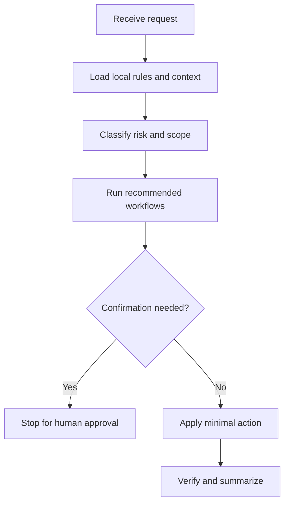

# api-sync

## Use Cases

Backend-to-frontend API synchronization, DTO shape changes, enum value additions, and request wrapper updates.

## Non-Use Cases

Speculative UI redesign, unrelated frontend cleanup, or syncing changes without a trusted backend diff.

## Supported OS

Windows, macOS, and Linux. Any OS-specific branch must be detected and explained.

## Inputs

Base branch, target branch or SHA, merge-base SHA, backend diff, frontend paths, and validation commands.

## Outputs

Synced changes, excluded changes with reasons, base branch, base SHA, target SHA, merge-base SHA, and validation evidence.

## Execution Steps

Resolve refs, inspect contracts, map frontend usage, update minimal surfaces, validate, and document exclusions.

## Human Confirmation Points

Ask before changing broad UI behavior, adopting unmerged backend semantics, or modifying generated clients without regeneration rules.

## Failure Handling

If SHAs or contract evidence are missing, report the exact missing reference and avoid guessing API behavior.

## Example Prompts

- "Sync frontend to backend DTO changes between main and this branch."`n- "List excluded backend changes and why."

## Recommended Workflows

preflight, gate-check

## Flowchart

