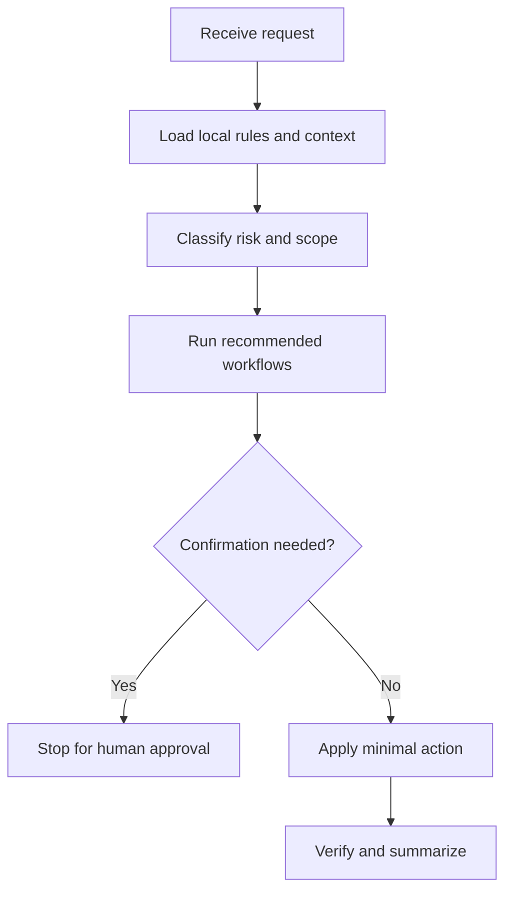

# dms-repair

## Use Cases

Data repair planning, readonly diagnosis, DMS handoff SQL, and post-execution verification.

## Non-Use Cases

Direct production writes, unmanaged migrations, or executing SQL through an unapproved connection.

## Supported OS

Windows, macOS, and Linux. Any OS-specific branch must be detected and explained.

## Inputs

Business identifier, readonly wrapper path, expected state, SQL constraints, and post-check query.

## Outputs

Readonly evidence, minimal SQL proposal, DMS execution handoff, post-check evidence, and source consistency explanation.

## Execution Steps

Prove current state, minimize write set, request human execution, verify after execution, and explain consistency.

## Human Confirmation Points

Human approval is required before every write, DDL, production configuration change, or DMS execution.

## Failure Handling

Reject write SQL in agent-run workflows. If readonly evidence is missing, do not prepare final repair SQL.

## Example Prompts

- "Prepare the DMS SQL but do not execute it."`n- "Run only readonly confirmation before suggesting the fix."

## Recommended Workflows

db-read

## Flowchart

