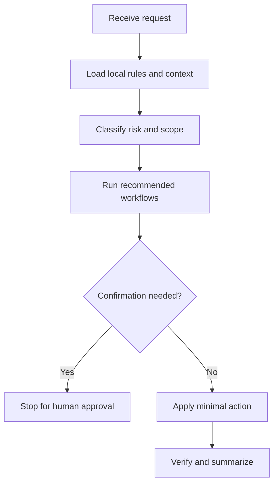

# env-audit

## Use Cases

Dependency audits, shell/PATH diagnosis, toolchain readiness checks, and machine setup gap analysis.

## Non-Use Cases

Installing tools without approval, modifying registries/startup entries without confirmation, or assuming one OS profile applies everywhere.

## Supported OS

Windows, macOS, and Linux. Any OS-specific branch must be detected and explained.

## Inputs

Target checklist, current shell, repo path if relevant, allowed commands, and explicit install/no-install boundaries.

## Outputs

Readonly findings, root-cause classification, minimum missing prerequisites, and authorized next actions.

## Execution Steps

Detect platform, collect readonly evidence, map symptoms to root causes, avoid mutations, and recommend the smallest next step.

## Human Confirmation Points

Any install, uninstall, PATH mutation, registry/startup change, chmod on project files, or package-manager operation needs approval.

## Failure Handling

Skip unsupported OS-specific checks with a clear explanation and keep audit claims scoped to gathered evidence.

## Example Prompts

- "Audit this machine against the checklist; do not install anything."`n- "Tell me the minimum missing prerequisite first."

## Recommended Workflows

preflight, gate-check

## Flowchart

