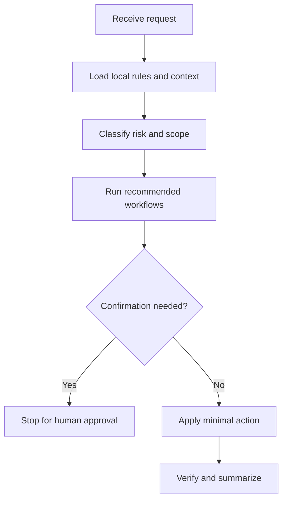

# guarded-change

## Use Cases

Governed code edits, policy-heavy repositories, scoped fixes, and work that requires source-backed verification.

## Non-Use Cases

Broad rewrites without a stated goal, production writes, or tasks where the user only asked for analysis.

## Supported OS

Windows, macOS, and Linux. Any OS-specific branch must be detected and explained.

## Inputs

Repository path, requested change, known rule files, risk constraints, and validation commands.

## Outputs

Minimal patch, verification results, changed-file summary, and any confirmation requests.

## Execution Steps

Read governance, inspect git status, map risk, edit narrowly, run gates, and report exact results.

## Human Confirmation Points

Commit, push, destructive cleanup, dependency installation, cross-repository edits, and production changes.

## Failure Handling

Stop on conflicting rules, unclear ownership, or unsafe requested mutation. Report exact paths and next safe action.

## Example Prompts

- "Apply this small fix under the repo rules."`n- "Read AGENTS.md and CLAUDE.md before changing the module."

## Recommended Workflows

preflight, gate-check

## Flowchart

