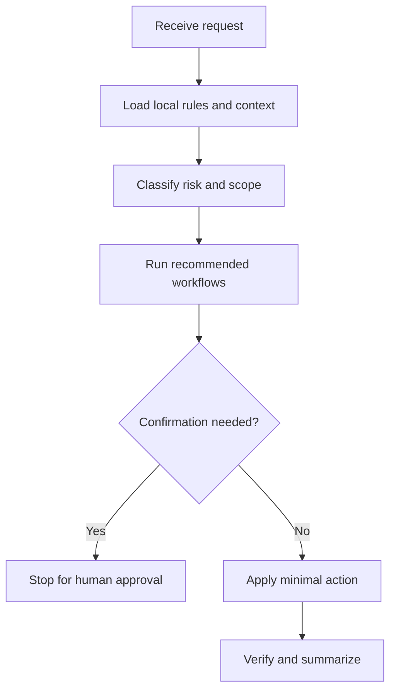

# merge-fix

## Use Cases

Merge conflicts, rebase conflicts, generated-file conflict checks, and conflict-marker cleanup.

## Non-Use Cases

Mechanical ours/theirs selection, unrelated refactors during conflict resolution, or merge finalization without user confirmation.

## Supported OS

Windows, macOS, and Linux. Any OS-specific branch must be detected and explained.

## Inputs

Conflict list, base/ours/theirs context, repo rules, generated artifact instructions, and validation commands.

## Outputs

Resolved files, rationale per conflict, marker scan result, and validation result.

## Execution Steps

Inspect conflicts, reason through intent, edit carefully, check markers, run focused gates, and report remaining manual decisions.

## Human Confirmation Points

Ask before discarding either side, regenerating large artifacts, committing the merge, or changing unrelated files.

## Failure Handling

If intent cannot be inferred, stop with exact files and the competing behaviors that need human choice.

## Example Prompts

- "Resolve the merge preserving both feature lines."`n- "Do not choose ours/theirs mechanically."

## Recommended Workflows

merge-check, gate-check

## Flowchart

