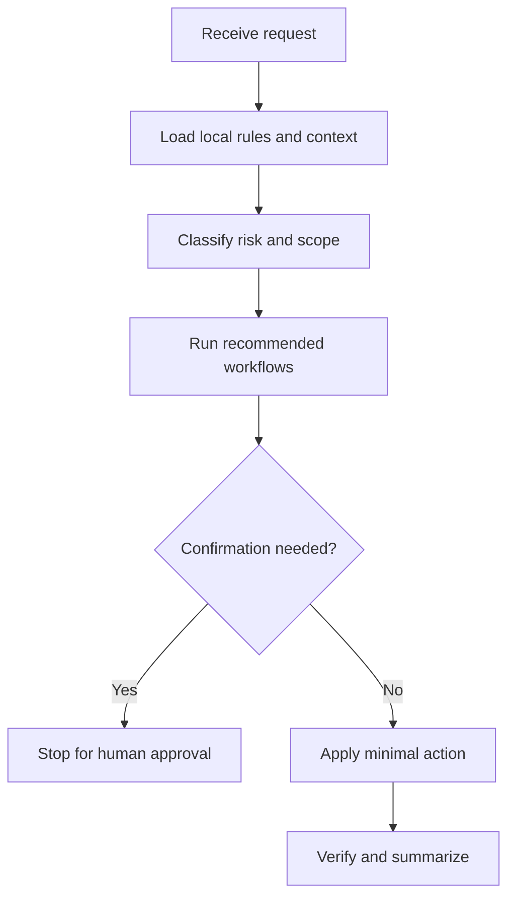

# pay-docs

## Use Cases

支付流程文档、订阅行为说明、配置解释、Webhook 场景矩阵和测试环境说明。输出应中文优先，英文仅用于保留代码标识、配置键、枚举值和日志关键字。

## Non-Use Cases

Unverified product claims, marketing copy, or payment behavior changes.

## Supported OS

Windows, macOS, and Linux. Any OS-specific branch must be detected and explained.

## Inputs

Source paths, config files, branch context, target audience, and verification commands.

## Outputs

中文优先的结构化文档，包含术语表、场景矩阵、配置键、验证点、风险和待确认事项。

## Execution Steps

读取源码和配置，将事实与推断分开；用中文组织说明；保留精确的配置键、状态值和枚举名；如存在文档生成器，运行对应校验。

## Human Confirmation Points

Ask before changing live config, updating payment behavior, publishing docs externally, or asserting unverified webhook subscription state.

## Failure Handling

If code proves a handler path but not live subscription, state that boundary directly.

## Example Prompts

- "为这组订阅配置写一份中文说明，保留配置键原文。"
- "每个支付场景都要标明源码依据和待确认项。"

## Recommended Workflows

doc-check

## Flowchart

