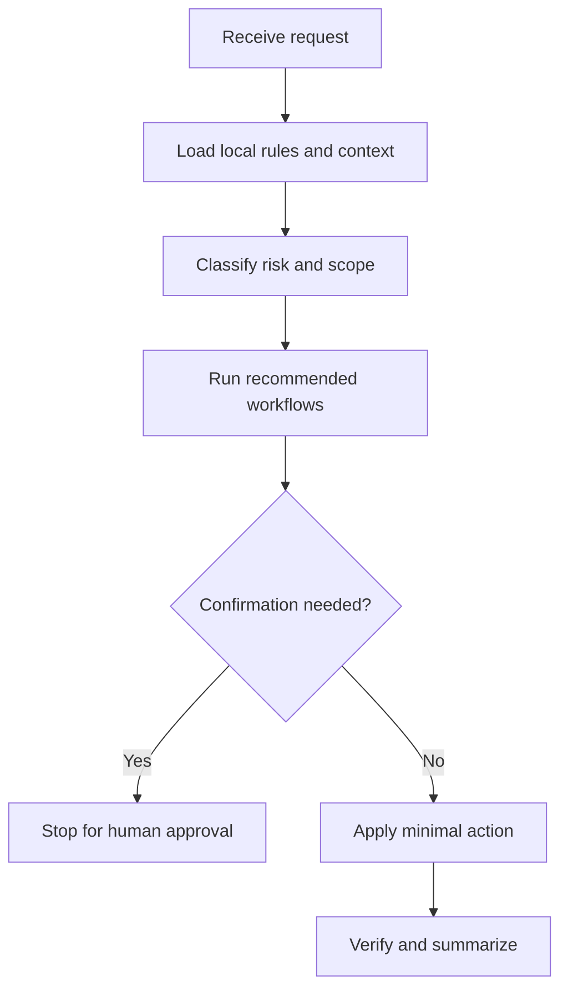

# review-loop

## Use Cases

Iterative code review/fix cycles, branch cleanup, and requests that explicitly require re-review.

## Non-Use Cases

Full repository audits unless explicitly requested, style-only churn, or unbounded feature expansion.

## Supported OS

Windows, macOS, and Linux. Any OS-specific branch must be detected and explained.

## Inputs

Current branch diff, base reference if known, repo rules, and allowed validation commands.

## Outputs

Findings, fixes, re-review result, residual risks, and verification evidence.

## Execution Steps

Capture snapshot, prioritize defects, patch narrowly, run gates, repeat review, and distinguish in-scope clean from exhaustive clean.

## Human Confirmation Points

Ask before broad refactors, commit/push, risky migrations, or modifying files outside the reviewed diff.

## Failure Handling

If no credible verification is available, state the gap and keep review claims scoped to inspected evidence.

## Example Prompts

- "Review my current changes, fix issues, and repeat until clean."`n- "Only consider files changed on this branch."

## Recommended Workflows

preflight, gate-check

## Flowchart

