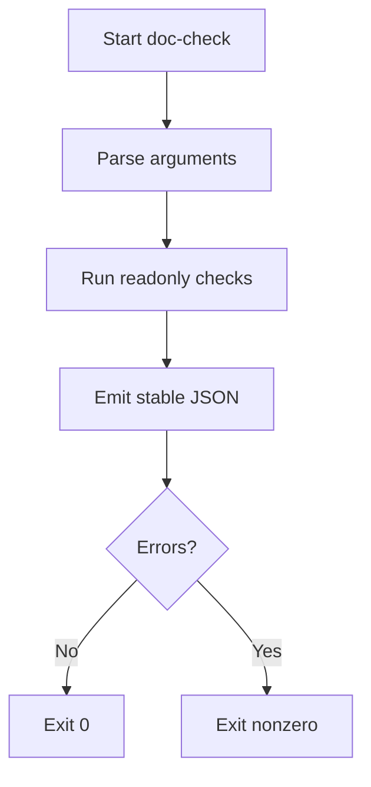

# doc-check Workflow

## Purpose
Aggregate documentation checks and optional safe custom commands while reporting missing runtimes instead of assuming Python exists.

## Supported OS

Windows 10/11 with Windows PowerShell 5.1 or PowerShell 7+, macOS with Bash or PowerShell 7+, and Linux with Bash or PowerShell 7+.

## Parameters

- PowerShell: `-Path`, `-CustomCommand`, `-Sql`, `-SqlFile`, `-Help` where applicable.
- Bash: `--path`, `--custom-command`, `--sql`, `--sql-file`, `--help` where applicable.

## JSON Schema Summary

Every run returns `ok`, `workflow`, `cwd`, `os`, `checks`, `warnings`, and `errors`. Extra workflow-specific details may appear inside `checks`.

## Example Commands

```powershell
.\workflows\doc-check\doc-check.ps1 -Path .
```

```bash
./workflows/doc-check/doc-check.sh --path .
```

## Example Output

See `examples/sample-output.json`.

## Exit Code Convention

Exit code `0` means the workflow finished without validation errors. Nonzero means invalid arguments, validation failure, or rejected unsafe input.

## Matching Skills

pay-docs

## Flow


